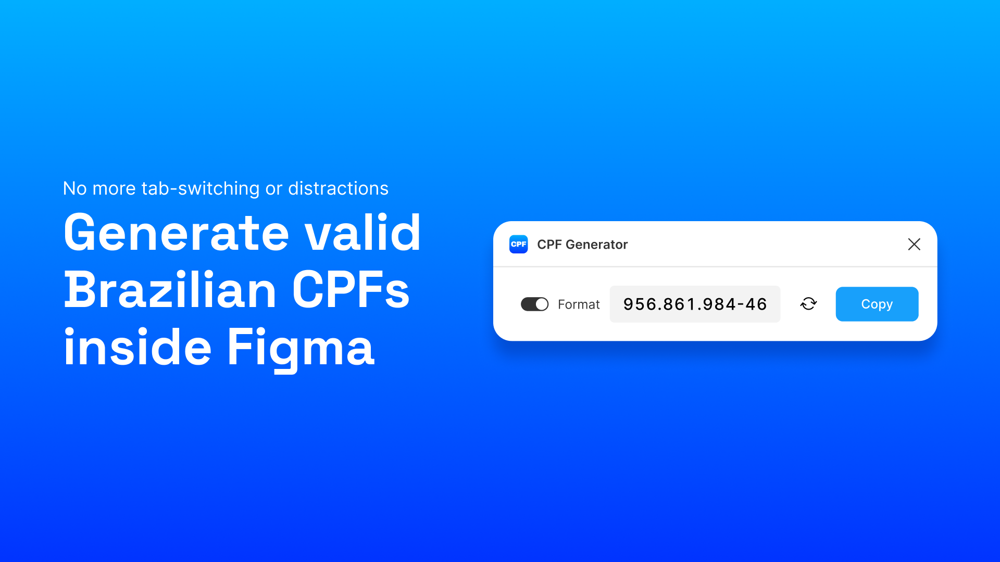

# CPF Generator - Figma Plugin

A simple and minimalist Figma plugin to generate valid Brazilian CPF numbers for testing and prototyping purposes.

[Use now!](https://www.figma.com/community/plugin/1602069334179415325/cpf-generator) 

## About
This project was created as a learning exercise to explore:
- Figma plugin development
- Front-end development with real use cases
- Git workflow and version control

## Features

- ✅ Generates valid CPF numbers (11 digits, unformatted)
- 📋 One-click copy to clipboard
- ⚡ Fast and lightweight
- 🎨 Clean UI using Figma Plugin DS

## Tech Stack
- TypeScript (plugin logic)
- HTML/CSS/JavaScript (UI)
- [Figma Plugin DS](https://github.com/thomas-lowry/figma-plugin-ds) (Design system)
